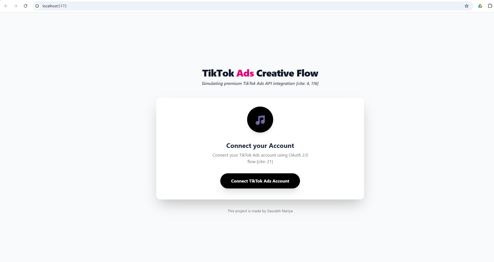
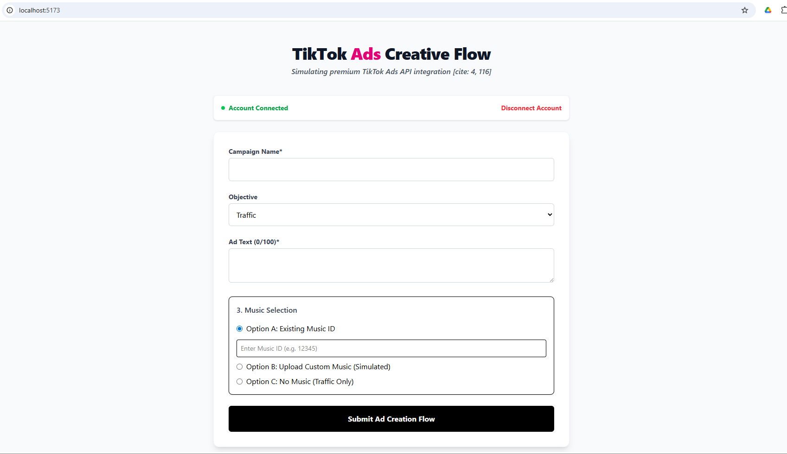
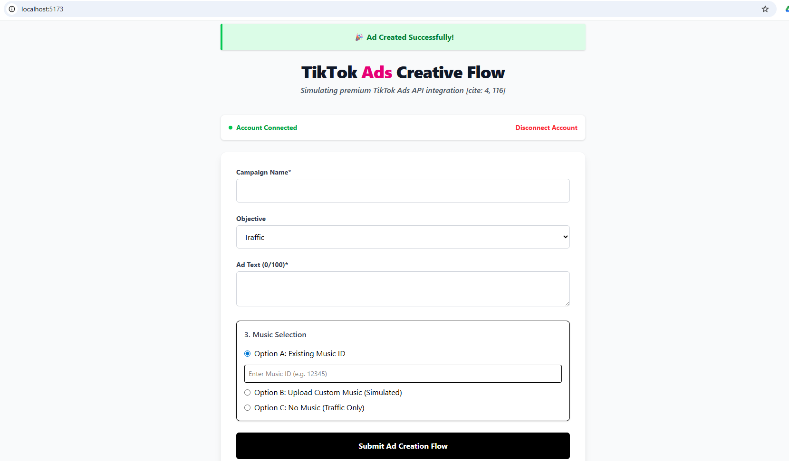

# TikTok Ads Creative Flow  

---

## 📌 Overview

This project is a **frontend-only application** that simulates a **TikTok Ads creative setup flow**.  
The focus is on **OAuth integration**, **conditional validation**, and **graceful API error handling**,  
**not** on building a full Ads Manager.

### The application allows a user to:
- **Connect** a TikTok Ads account using OAuth  
- **Create** a minimal ad with creative details  
- **Handle** real-world API errors in a user-friendly way  

---

## 🛠 Tech Stack

- **Library:** React  
- **Styling:** Minimal CSS  
- **Backend:** *Not required*  
- **API Integration:** TikTok Ads API *(mocked where necessary)*  

---

## 🚀 How to Run the Project

### Prerequisites
- **Node.js** *(v16 or later recommended)*  
- **npm** or **yarn**

### Install dependencies
**npm install**

### Start development server
***npm run dev***

### The app will be available at:

http://localhost:5173

## 📸 Application Screenshots

### 1️⃣ Connect TikTok Ads Account (OAuth Simulation)
This screen shows the initial OAuth-based TikTok Ads account connection flow.

---

### 2️⃣ Ad Creative Form
This screen demonstrates the ad creation form where users configure:
- Campaign name
- Objective (Traffic / Conversions)
- Ad text
- Music selection with conditional validation

---

### 3️⃣ Ad Created Successfully
After successful validation and simulated API response, a success message is displayed confirming ad creation.

## 🔐 OAuth Setup Steps (TikTok Ads)

This project uses **TikTok Ads OAuth – Authorization Code Flow**.

### Step 1: Create TikTok Developer Account
- Sign up at **TikTok for Developers**
- Enable **TikTok Ads access**

### Step 2: Create a TikTok Ads App
- Go to the **TikTok Developer Dashboard**
- Create a new **Ads App**
- Note down:
  - **Client Key**
  - **Client Secret**

### Step 3: Configure OAuth
Set **Redirect URI** to:
http://localhost:5173/oauth/callback

Enable required scope:
ads_management

### Step 4: Update Project Config
- Add your **`client_key`** in the OAuth config file

### OAuth Flow
The app will:
- Redirect users to **TikTok OAuth**
- Receive **authorization code**
- Exchange it for an **access token**
- Store the token in **localStorage**

---

## ⚠️ OAuth Error Handling

The UI converts OAuth/API errors into **human-readable messages**, including:

- **Invalid client credentials**
- **Missing permission scopes**
- **Expired or revoked tokens**
- **Geo-restriction (403 errors)**

⚠️ **Raw API error JSON is never shown to users.**

---

## 🎵 Music Selection Logic

The app supports **three music options**:

### Existing Music ID
- User enters a **Music ID**
- Validated via API or mocked endpoint
- **Invalid ID blocks submission**

### Upload / Custom Music
- Upload is **simulated**
- A **mock Music ID** is generated
- Validation errors are handled gracefully

### No Music
- ✅ Allowed only if **Objective = Traffic**
- ❌ Blocked if **Objective = Conversions**

➡️ All rules are enforced **client-side before submission**.

---

## 📤 Submission & Error Handling

On ad submission, the app handles:

- **Invalid or expired OAuth token**
- **Missing permissions**
- **Invalid music ID**
- **Geo-restriction errors**

### UX Strategy
- **Field-level errors:** Inline messages  
- **System-level errors:** Global error banner  
- Clear guidance on **how to fix issues**

---

## 🧠 Assumptions & Shortcuts

To keep the project focused and realistic under time constraints, the following assumptions were made:

- No backend is used; token storage is handled on the frontend  
- Some TikTok Ads APIs are **mocked** due to geo or access restrictions  
- Music upload is **simulated** *(no real file handling)*  
- Access token is stored in **localStorage** for simplicity  
- UI styling is minimal to prioritize logic and correctness  
- No retry or refresh-token logic implemented  

✔️ All assumptions are documented intentionally.

---

## 🔮 Possible Improvements

With more time, the following could be added:

- Backend-based OAuth token handling  
- Token refresh mechanism  
- Retry logic for failed API calls  
- Better loading and success states  
- Unit and integration tests  

---

## 📝 Final Note

This project is designed to reflect a **real-world frontend feature built under time pressure**,  
focusing on **decision-making**, **validation logic**, and **error handling**, rather than feature completeness.

---

# This Project is made by:

## 📞 Contact

**Saurabh Nariya**  
📧 *saurabhnariya1234@gmail.com*
